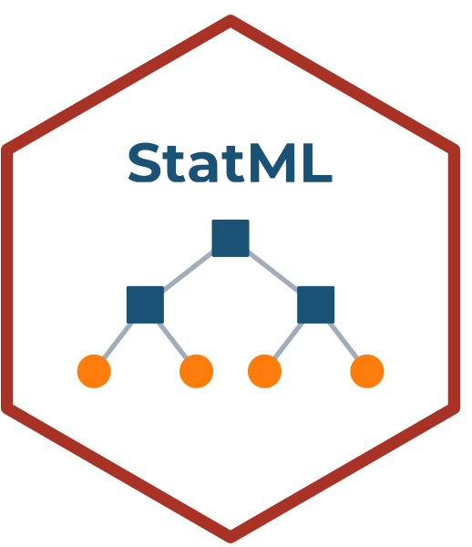

# StatML 

<!-- badges: start -->
<!-- badges: end -->

**StatML** es una plataforma interactiva de machine learning, parte del ecosistema [StatSuite](https://github.com/ManuelSpinola). Diseñada para enseñanza e investigación en ecología, ciencias de la biodiversidad y ciencia de datos.

## Módulos disponibles

| Módulo | Algoritmo | Tarea | Estado |
|--------|-----------|-------|--------|
| Regresión lineal | LM | Regresión | ✅ Disponible |
| Clasificación GLM | GLM logístico | Clasificación | ✅ Disponible |
| Random Forest | tidymodels + ranger | Regresión | ✅ Disponible |
| Random Forest | tidymodels + ranger | Clasificación | ✅ Disponible |

## Instalación

```r
install.packages("remotes")
remotes::install_github("ManuelSpinola/StatML")
```

## Uso

```r
library(StatML)
StatML::run_app()
```

## StatSuite

StatML forma parte de **StatSuite**, un ecosistema de aplicaciones Shiny para análisis de datos ecológicos:

- **StatFlow** — Primeros pasos en análisis de datos
- **StatDesign** — Diseño de estudios y muestreo
- **StatModels** — Modelación estadística
- **StatML** — Machine learning ← esta app
- **StatGeo** — Análisis espacial y SIG
- **StatOccu** — Modelos de ocupación
- **StatMonitor** — Monitoreo de biodiversidad

## Autor

**Manuel Spínola**  
ICOMVIS · Universidad Nacional · Costa Rica

## Licencia

MIT
